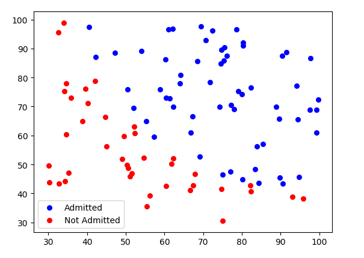

### 1. 本节视频3,4,8,9
### 2. 知识点
 - 利用 `Matplotlib`画图
    - [Matplotlib画图系列(一)简易线形图及散点图](https://blog.csdn.net/The_lastest/article/details/79828638)
    - [Matplotlib画图系列(二)误差曲线(errorbar) ](https://blog.csdn.net/The_lastest/article/details/79829046)
 - 逻辑回归代价函数的由来
    - [Logistic回归代价函数的数学推导及实现](https://blog.csdn.net/The_lastest/article/details/78761577)
 - 利用sklearn库来实现逻辑回归
    - 见示例3
### 3. 算法示例:
- 示例1[breast_cancer分类](LogisticRegression.py) 
- 示例2[是否录取分类](e2.py)
    - 可视化
    
    - 损失图
    
- 示例3[用sklearn库实现示例2](e3.py)
 
 
 ### [<主页>](../README.md) [<下一讲>](../Lecture_03/README.md)