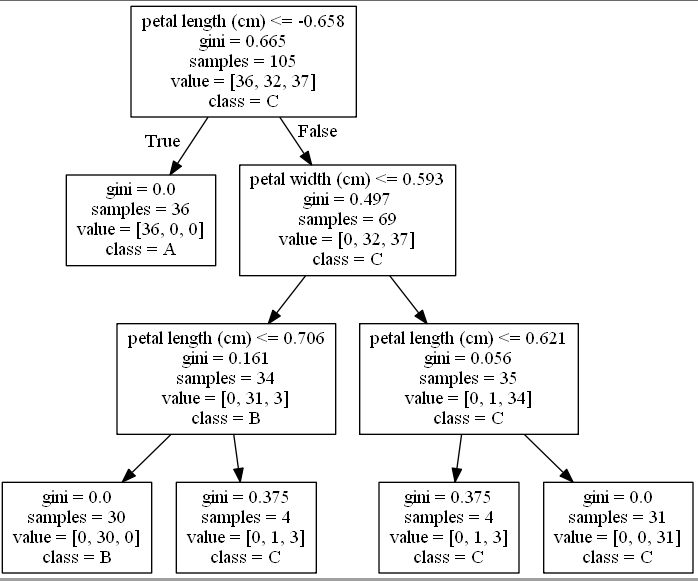

### 1. 本节视频
- 本节视频11,12
### 2. 知识点
- 2.1 什么是决策树(decision tree)？什么是信息熵?
    - [决策树——（一）决策树的思想](https://blog.csdn.net/The_lastest/article/details/78906751)
- 2.2 决策树的构造与剪枝?
    - [决策树——（二）决策树的生成与剪枝ID3,C4.5](https://blog.csdn.net/The_lastest/article/details/78915862)
    - [决策树——（三）决策树的生成与剪枝CART](https://blog.csdn.net/The_lastest/article/details/78975439)
- 2.3 决策树的可视化
    - [Graphviz](https://graphviz.gitlab.io/_pages/Download/Download_windows.html)
    - [机器学习笔记——决策数实现及使用Graphviz查看](https://blog.csdn.net/akadiao/article/details/77800909)
    
    
### 3. 示例 
- 示例1[  iris分类](ex1.py)
### 4. 任务
- 4.1 熟悉查看[scikit-learn API](http://scikit-learn.org/stable/modules/classes.html) 
### [<主页>](../README.md) [<下一讲>](../Lecture_05/README.md)