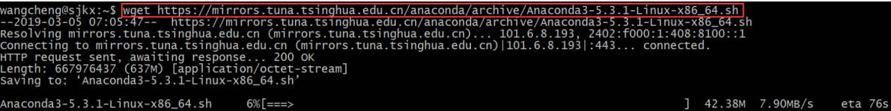
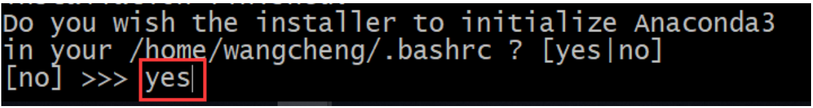
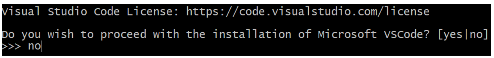

### 一、安装Anaconda​	

#### 1.下载Anaconda

- (1) 在`https://mirrors.tuna.tsinghua.edu.cn/anaconda/archive/`找到对应的anaconda版本并复制链接地址

  - 例如：`https://mirrors.tuna.tsinghua.edu.cn/anaconda/archive/Anaconda3-5.3.1-Linux-x86_64.sh`

    

- (2) 利用`wget`命令下载anaconda

  - `wget https://mirrors.tuna.tsinghua.edu.cn/anaconda/archive/Anaconda3-5.3.1-Linux-x86_64.sh`

#### 2.  赋权限并安装

- 赋权限 `chmod +x Anaconda3-5.3.1-Linux-x86_64.sh`

- 安装`bash Anaconda3-5.3.1-Linux-x86_64.sh`

  安装时一路按回车健即可，这一步选择yes添加到环境变量

  

  如果没有这一步，等安装完成后手动添加到环境变量

  - `echo 'export PATH="/home/userneme/anaconda3/bin:$PATH"' >> ~/.bashrc`
  - 激活环境变量 `source .bashrc`

  上面的命令要灵活改变，比如用户名和anaconda3这两个部分不同的人不一样

  

- 检查是否安装成功

  `conda --version`

  如果输入以上命令能正确显示Anaconda版本号则安装成功。

#### 3. 换掉默认anaconda源地址（可选）

```shell
conda config --add channels https://mirrors.tuna.tsinghua.edu.cn/anaconda/pkgs/free/
conda config --add channels https://mirrors.tuna.tsinghua.edu.cn/anaconda/pkgs/main/
conda config --set show_channel_urls yes
```

### 二、Anaconda 环境管理

#### 1. 创建环境

- 安装好`Anaconda`后在终端种使用`conda create -n env_name`（`-n env_name`表示指定虚拟环境的名称）

- 同时指定虚拟环境的`Python`版本号 `conda create -n env_name python=3.5`

- 在创建环境时就安装指定的`Python`包 `conda create -n env_name numpy`

  <font color = red>注：以上三条命令选择其中之一即可</font>

#### 2. 管理环境

- 创建环境后使用`conda activate env_name`进入该环境，Windows上使用`activate env_name`

- 安装新的`python`包使用`conda install package_name`，删除`conda uninstall package_name`

  （使用`pip install package_name`也可以，安装好也能用）

- 退出环境`conda deactivate`，Windows上使用`source deactivate`

### 3. 保存和加载环境

- 使用`conda env export > environment.yaml`可将现有的环境配置导出
- 使用`conda env create -f environment.yaml`可以创建一个和`environment.yaml`配置一样的虚拟环境
- 使用`conda env list`列出所有的虚拟环境
- 使用`conda env remove -n env_name`删除环境

