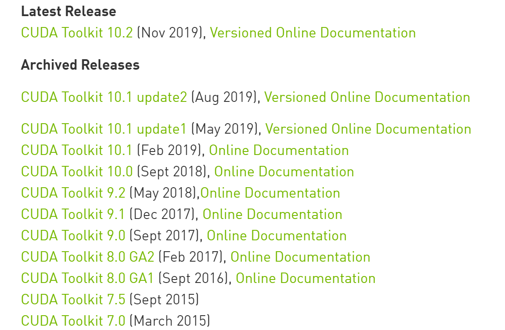
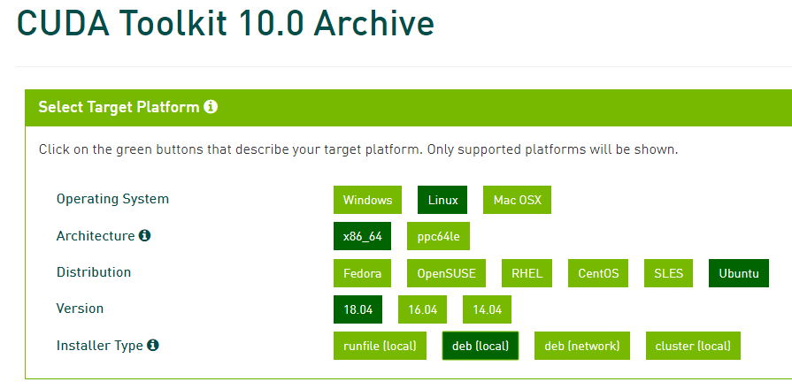
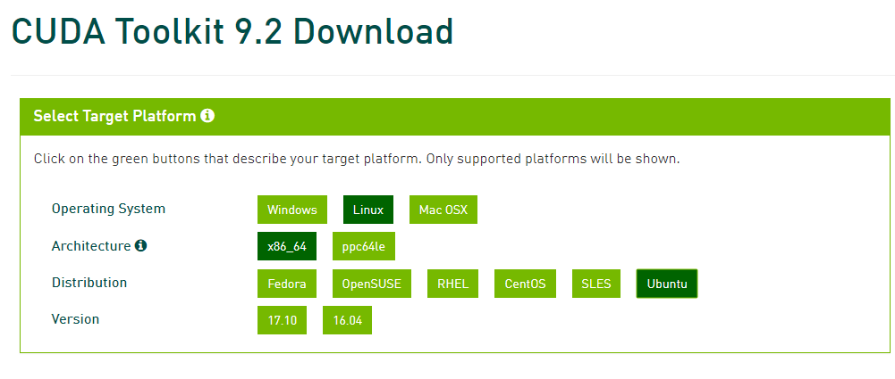
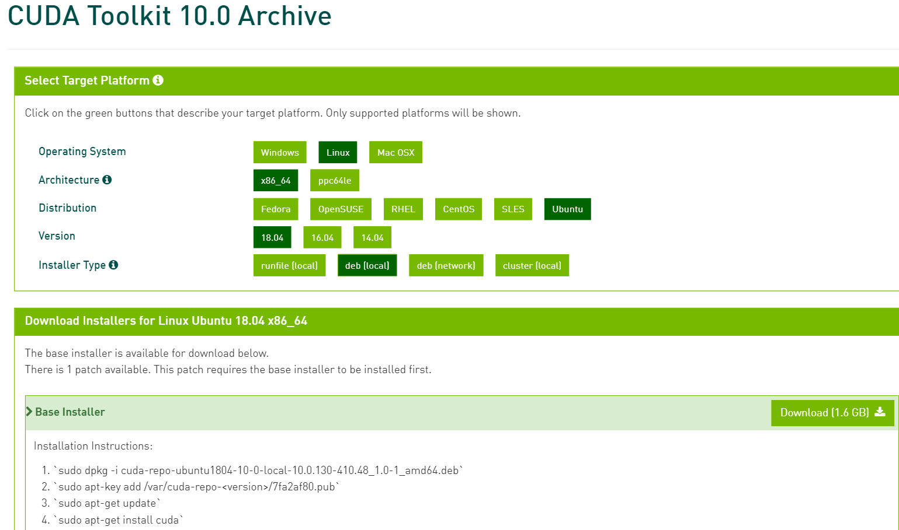
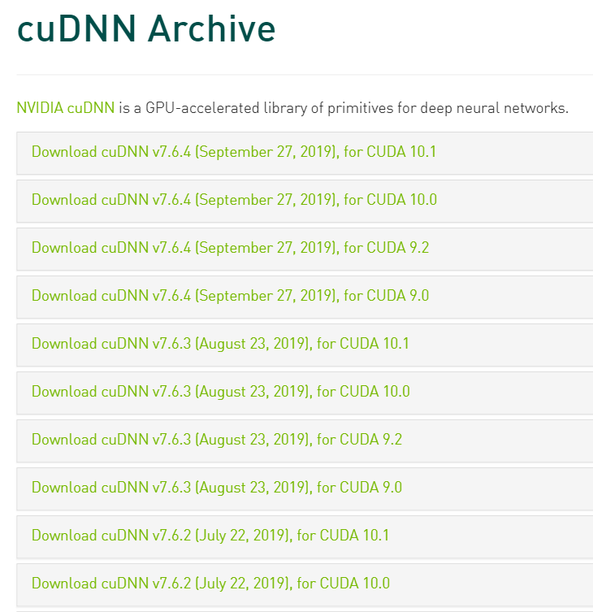

# CUDA及cuDNN安装方式

首先说明一下CUDA，CUDA Toolkit，cuDNN三者的关系，这样也便于理解。

- CUDA就是CUDA Toolkit，两者值的是同一个东西，CUDA Toolkit里面就包含了较新的显卡驱动，安装了CUDA Toolkit后不用人为安装驱动；
- cuDNN是英伟达专门为深度学习所开发的用于深度神经网络的GPU加速库。

### 1. 选择CUDA版本

点击链接进入下载CUDA下载页面：`https://developer.nvidia.com/cuda-toolkit-archive`

可以看到最新的为10.2版本的，最老的有7.0版本的。对于到底选择哪个版本，可以视以下情况而定：

- 根据你所需要的Pytorch或者Tesorflow的版本而定，也就是说CUDA的版本和这两个框架的版本是有绑定关系的，如果你装了较新的CUDA，老版本的Pytorch或者Tensorflow肯定是用不了的，如下图：

  

  如果想要安装Pytorch1.3版本，那么就必须安装9.2或者10.1版本的CUDA。

- 根据安装系统的版本来，如下图所示：

  

  

  可以看到，10.0版本和9.2版本所支持的Ubuntu的系统不一样，9.2只支持到17.10，而10.0能支持到18.04。

  如果你前面安装的是18.04版本的Ubuntu那么这儿就只能安装10.0以上的CUDA。

总结起来就是，如果你一定要安装特定版本的Pytorch或者Tensorflow，那么你可以根据Pytorch或者Tensorflow来反推CUDA和Ubuntu的版本；如果没有特定版本需要，那么你可以选择一个较新版本的Ubuntu，然后再正推后面CUDA和tensorflow的版本。

**注意，在选择系统的时候，一般机房里面的主机都只支持服务器版本的系统，例如Ubuntu就是server版本的而非Desktop版本的。具体表现就是如果在不支持Desktop版本的机子上安装Desktop版本的系统，能正常安装但是开机后会花屏无法显示。**

### 2.安装CUDA

由于这次安装时并没事先考虑到深度学习框架版本的问题，所有就安装了Ubuntu 18.04的版本。于是也就对应下载了10.0版本的CUDA。下载方式点击下图中的Download即可，对于后续版本，对应这个页面可能会有改变，但是都会有提示。

下载完成后我们会得到一个类似如下名字的文件：

`cuda-repo-ubuntu1804-10-0-local-10.0.105-418.39_1.0-1_amd64.deb`

将文件通过xshell或者其它方式上传到服务器即可，然后通过上面的4条命令安装。

当时在进行完这一步的时候以为大功告成了，但重启时发现系统在某个界面卡住了，进不去。于是我又重新安装了一次系统，再次安装10.0的CUDA然后重启，发现依旧是同样的问题。于是就开始想到底是哪儿处了问题，下面是想到的可能性：

- （1）在选择CUDA版本时，第二个选项`x86_64`，`ppc64le`，这两个到底该选哪个？点击Architecture上的感叹号后发现一般英特尔处理器或者amd64架构的服务器都选择`x86_64`，戴尔服务器一般选择后者。于是排除掉这个问题，因为我看到机子上贴了一个Intel的标签，其次我发现安装系统时下载的镜像名称为`ubuntu-18.04.3-live-server-amd64.iso`，且系统能安装成功，这就更加肯定是选择`x86_64`这个选项；
- （2）会不会是机子有点老，不支持Ubuntu 18.04，进而导致不支持CUDA 10.0；但是按理说18.04的Ubuntu都安装成功了，是这个问题的可能性较小，但也可能有；
- （3）会不会是较新的Ubuntu 18.04不支持CUDA 10.0，应该下载低版本的Ubuntu？ 但是上面CUDA 10.0的下载页面明显显示支持18.04，所以这个问题的可能性也比较小，但也可能有；
- （4）保持Ubuntu 18.04，换成其它支持18.04的CUDA试试，比如10.1，10.2也支持Ubuntu 18.04

经过上面的分析于是做了如下准备进行尝试：

首先下载了CUDA 10.1，CUDA 9.2，以及又制作了一个Ubuntu 16.04安装盘；然后尝试以下方案：

- 方案一：CUDA 10.1+Ubuntu 18.04
- 方案二：CUDA 10.0+Ubuntu 16.04
- 方案三：CUDA 9.2+Ubuntu 16.04

幸运的是，当尝试方案一的时候就成功了，也就没有再试后面的方案了。

### 3.安装cuDNN

安装好CUDA后下一步就该安装cuDNN了。首先进入Nvidia官网，然后找到对应匹配CUDA版本的cuDNN下载链接：

`https://developer.nvidia.com/rdp/cudnn-archive`

但是由于首先要注册才能下载，并且要选择正确的版本，稍微有点麻烦。所以这里就暂时提供另外一种更方便的安装方式，即通过Pytorch来安装，[点击此处跳转](./InstallPytorch.md)。