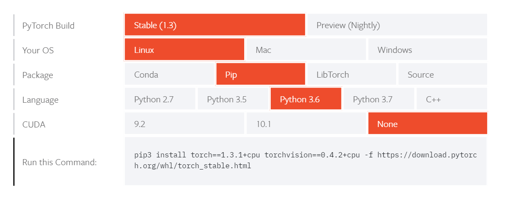
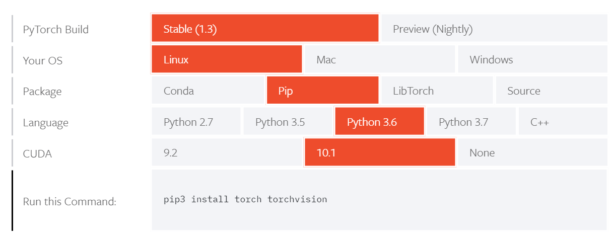

# Pytorch 安装

Pytorch的安装比起Tensorflow来说简直是太友好了，尤其是GPU版本的安装。

## 1. Pytorch CPU版本安装

- 点击下面链接进入官网：

  `https://pytorch.org/get-started/locally/`

- 选择对应版本：

  

- 运行命令`pip3 install torch==1.3.1+cpu torchvision==0.4.2+cpu -f https://download.pytorch.org/whl/torch_stable.html`

  在自己的电脑上也有可能是`pip install ......`，取决于`pip`的默认设置

## 2. Pytorch GPU版本安装

在前面[安装完成CUDA后](./InstallCUDA.md)，选择如下对应CUDA版本的Pytorch即可。



如图所示，通过`pip3 install torch torchvision`命令即可安装完成，同时还会帮你自动匹配好cuDNN的版本并进行安装。

```python
>>> import torch
>>> print(torch.cuda.is_available())
True
```

如果输出为True的话，则表示安装成功。

