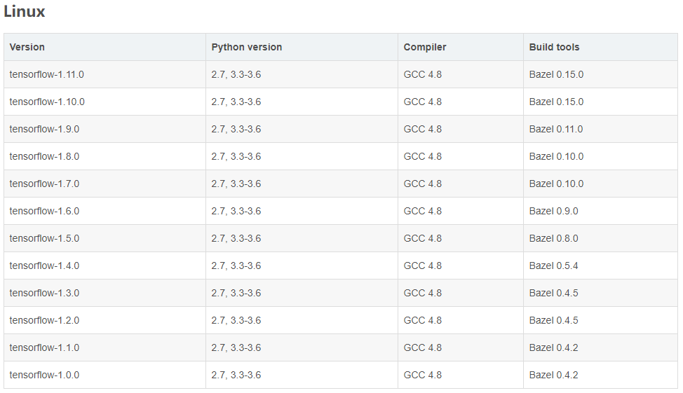
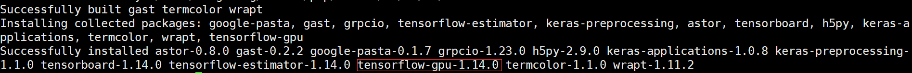
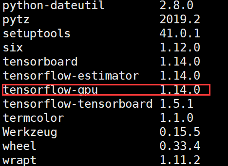
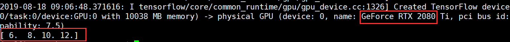

## Tensorflow GPU版本安装

此处我们通过之前安装好的`Anaconda`来管理环境，所以不用区分Linux还是Windows，安装方式都是一样的。

#### 1. 激活之前用`Anaconda`建立的虚拟环境

​	`conda activate py36` （py36是你自己虚拟环境的名称）

​	如果出现类似如下报错，可先用`source deactivate`命令，然后再使用`conda activate py36`命令。

```shell
CommandNotFoundError: Your shell has not been properly configured to use 'conda activate'.
If your shell is Bash or a Bourne variant, enable conda for the current user with

    $ echo ". /home/xxxxx/anaconda3/etc/profile.d/conda.sh" >> ~/.bashrc

```

#### 2. 安装GPU版本的Tensorflow

- （1）查看对应关系

  由于GPU版本的Tensorflow与显卡的版本号有着极强的依赖关系，所以需要安装对应版本的Tensorflow和显卡驱动。查找方法直接搜索Tensorflow与CUDA版本对应关系即可找到类似如下表格：

  

- （2）查看本地CUDA和cuDNN版本

  ```shell
  ~$ cat /usr/local/cuda/version.txt
  CUDA Version 10.0.130
  
  ~$ cat /usr/local/cuda/include/cudnn.h | grep CUDNN_MAJOR -A 2
  #define CUDNN_MAJOR 7
  #define CUDNN_MINOR 6
  #define CUDNN_PATCHLEVEL 0
  --
  #define CUDNN_VERSION (CUDNN_MAJOR * 1000 + CUDNN_MINOR * 100 + CUDNN_PATCHLEVEL)
  
  #include "driver_types.h"
  ```

  由此我们可以看到，CUDA的版本号为：10.0.130，CUDNN版本号：7.6.0

- （3）安装gpu版Tensor flow

  搜索得知，该CUDA版本下的环境支持Tensorflow gpu1.14.0版本，因此在安装时要指定特定版本号

​		`pip install tensorflow-gpu==1.14.0` （可指定版本号）



​		如果`pip install` 安装时，提示找不到对应版本，则可以使用`conda install`来进行安装；若还是找不		到，则需要使用其它的源来进行安装。

​		[参见此处](https://mirrors.tuna.tsinghua.edu.cn/help/pypi/)

#### 3. 检查是否安装成功

- 可以通过`pip list`（如果是用`conda install`安装的则使用`conda list`）来查看。

  <center>
  


- 通过一段示例代码来检测

  ```python
  import tensorflow as tf
  a = tf.constant(dtype = tf.float32,value=[5,6,7,8])
  b = tf.constant(dtype = tf.float32,value=[1,2,3,4])
  with tf.device('/gpu:0'):
      c = a+b
  with tf.Session() as sess:
      print(sess.run(c))
  
  ```

  

  如果能运行结果如上所示则安装成功！否则检查对应版本是否匹配，以及搜索提示的错误。