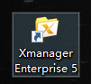
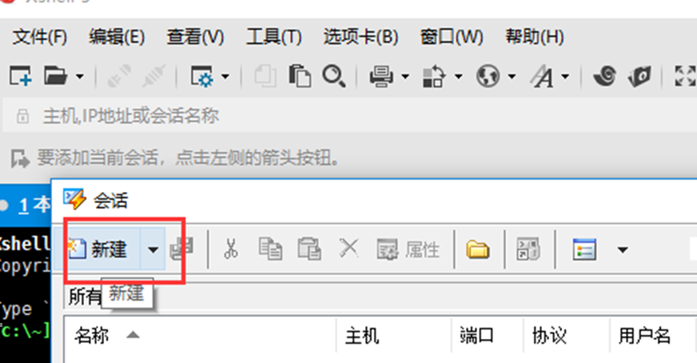
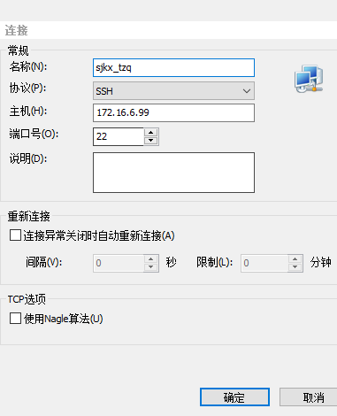
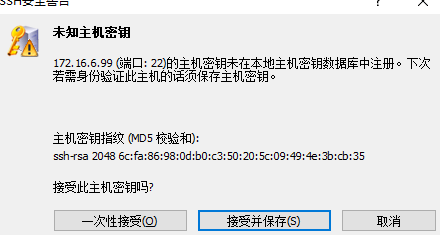
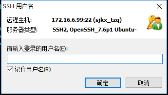
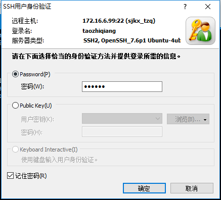

## 将IDE与服务器进行连接

[TOC]

通常情况下我们都是在服务器上运行程序，下面介绍一下Xshell工具的使用

### 1.首先安装好破解版的Xmanger Enterprise 5

这个工具主要是用来登录连接服务器的，可以实现记住账号和密码，方便下次登陆。安装完成后桌面上会多出一个文件夹，如下：

​	

### 2.在Shell中配置账号信息

#### 	2.1 安装好之后我们打开里面的Xshell工具：

​	

#### 	2.2 新建

#### 	2.3 填入账号信息

​	

​	

#### 	2.4 输入用户名并保存

​	

​		

这样就完成了注册和登陆的部分，之后就可以用Linux命令在你的账号下创建文件夹等等操作。

### 后续：

将IDE与服务器进行连接所要解决的痛点就是，当你的代码发生更改时不需要频繁的进行拖拽上传到服务器，仅仅只用一个快捷键`ctrl+s`就能解决。

